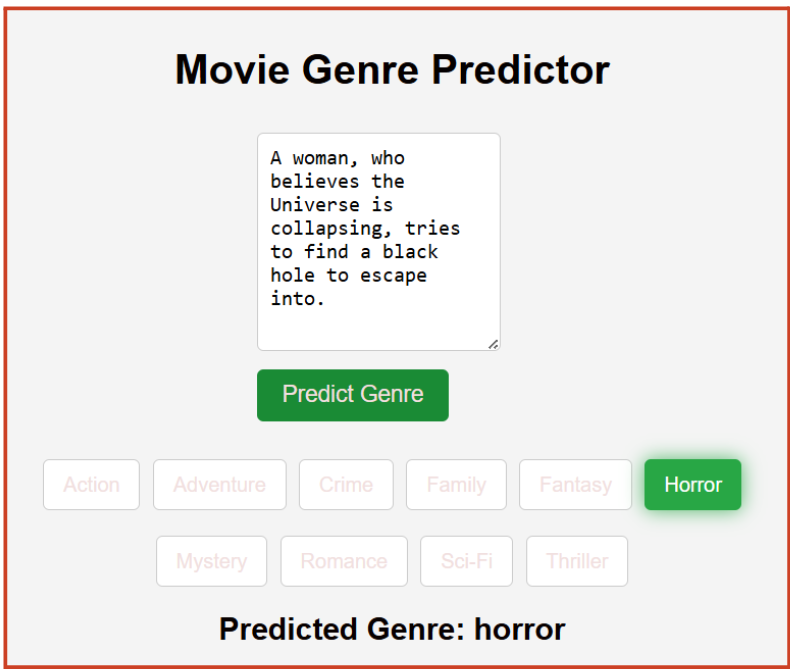
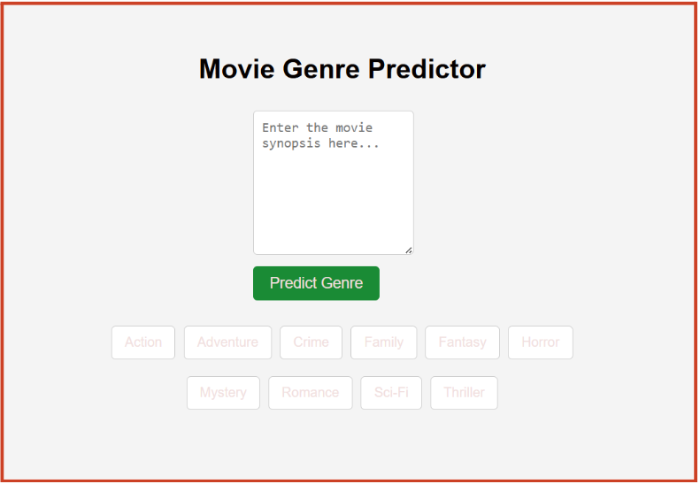

```markdown
# 🎬 MOVIE GENRE REVEL BOT 🤖

## Description

The goal of this project is to automate the process of identifying the genre of a movie based on its synopsis. The bot will classify movie synopses into genres such as action, adventure, crime, family, fantasy, horror, mystery, romance, scifi, or thriller.

---

## Image Requirements

### 1. **Bot Inference**  
   - Image name: `asset/1.png`  
   <p align="center">
     
   </p>

---

## Setup Instructions

### Steps to Install and Run the Project

1. **Create a Virtual Environment with Python 3.10**

   To create a new virtual environment with Python 3.10, run:

   ```bash
   conda create -n cardezzdev python==3.10
   ```

2. **Activate the Conda Environment**
   
   Once the environment is created, activate it to start using the packages within this isolated setup:

   ```bash
   conda activate cardezzdev
   ```

3. **Install Necessary Libraries and Run Setup**

   After activating the environment, install the required libraries by running the setup script. This will configure the necessary dependencies for the application:

   ```bash
   python setup.py
   ```

4. **Navigate to the `gpt_3.5` folder**

   ```bash
   cd gpt_3.5
   ```

5. **Training Phase**

   Run the training script:

   ```bash
   python gpt_train.py
   ```

   Change your fine-tuned model name in the `gpt_app.py` file.

6. **Inference Phase**

   Run the inference script:

   ```bash
   python app.py
   ```

   You will get the inference on your local host at `http://127.0.0.1:5000`.

---

### 2. **Bot Interface**  
   - Image name: `asset/2.png`  
   <p align="center">
     
   </p>


---

## Conclusion

This project provides an efficient way to automatically classify movie genres based on synopses. By following the setup instructions and running the training and inference phases, you'll be able to integrate this bot into your movie-related applications.
```


